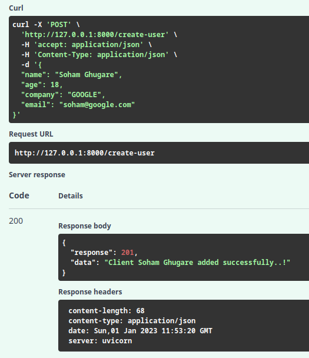
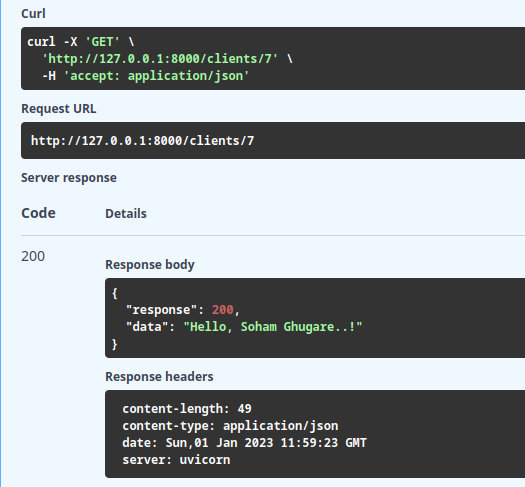
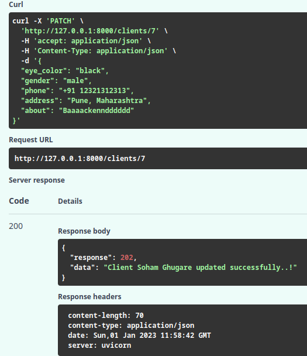
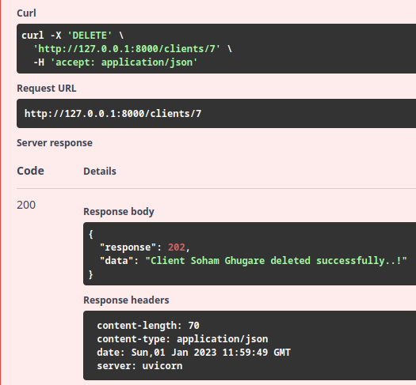

# Official repo for Profile API built during VITrendz recruitments
## Techstack used:
- [FastAPI](fastapi.tiangolo.com/) - A backend python framework built on OpenAPI and Starlette with performance on par with Golang and NodeJS
- [SQLModel](sqlmodel.tiangolo.com/) - An ORM built by the same author of FastAPI with powerful integrations for CRUD and DBMS operations
- [Uvicorn](https://www.uvicorn.org/) - An ASGI server implementation acting as a platform for the API
- [Railway](https://railway.app) - Hosting service used for hosting the API

## [Click here](https://profile-api-vitrendz-production.up.railway.app/) to check out the hosted API
## [Click here](https://profile-api-vitrendz-production.up.railway.app/docs) for testing the API with FastAPI Swagger UI

## API Endpoints:
- GET `/clients/{id}` - Fetch a particular client.
    - **Possible errors thrown:**
        - 404 - Client not found.
- GET `/clients` - Fetch all clients
    - **Queries:**
        - `/clients?gender=[male|female|all]` - Filters based on gender
        - `/clients?sort=[age|none]` - Sorts based on the query
- POST `/create-user` - Create a new user. Content-Type: application/json. Fields: [name, age, company, email]
    - **Possible errors thrown:**
        - 409 - Client already exists.
        - 400 - Email doesnt contain company name.
- DELETE `/clients/{id}` - Delete a particular client.
    - **Possible errors thrown:**
        - 404 - Client not found.
- PATCH `/clients/{id}` - Update a user. Content-Type: application/json.  
Fields allowed to update: [name, email, company, gender, picture, age, eye_color, phone, address, about, latitude, longitude]

## Instructions for running the API on local machine:
    1. Clone the repo and run `pip install -r requirements.txt` to install all dependencies
    2. Run `python api.py` to host the API on `0.0.0.0:5000` (you can change host and port in `api.py`)

# Note: For testing purposes, the curl commands are given below in snapshots.

## Snapshots:
- CREATE  

- READ  

- UPDATE  

- DELETE  
